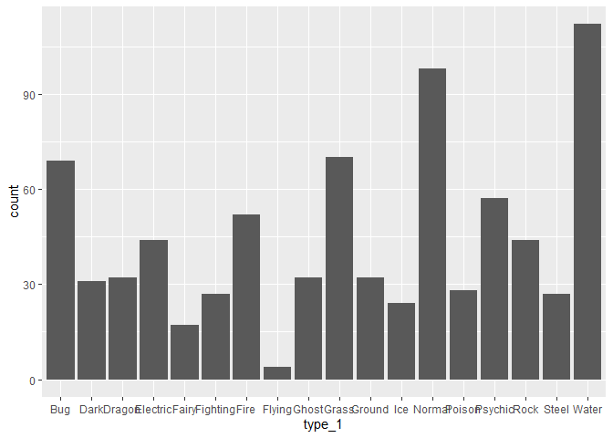
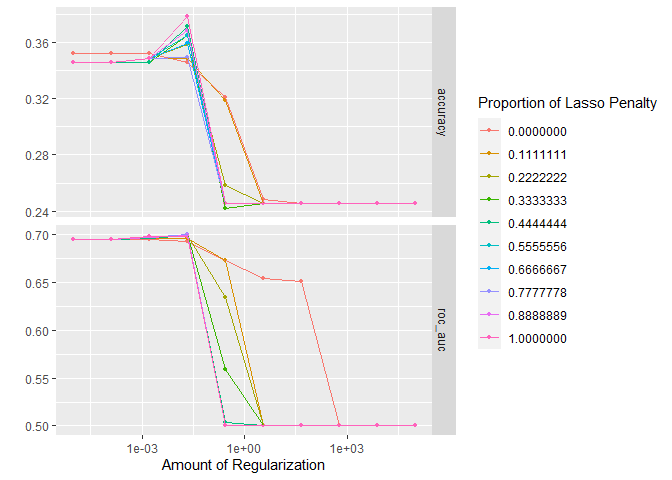
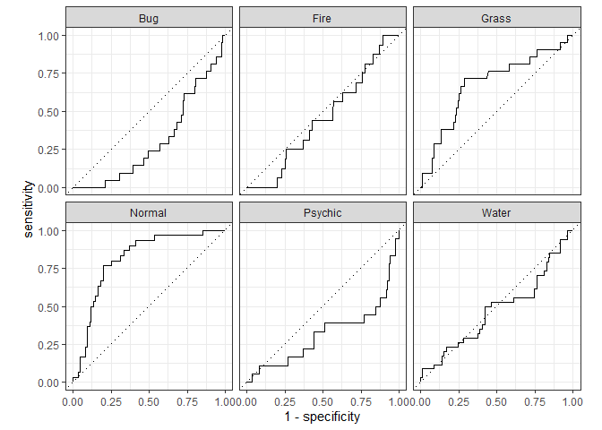
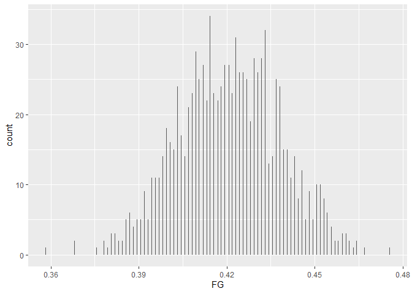

## Elastic Net Tuning

For this assignment, we will be working with the file `"pokemon.csv"`, found in `/data`. The file is from Kaggle: <https://www.kaggle.com/abcsds/pokemon>.

The [Pokémon](https://www.pokemon.com/us/) franchise encompasses video games, TV shows, movies, books, and a card game. This data set was drawn from the video game series and contains statistics about 721 Pokémon, or "pocket monsters." In Pokémon games, the user plays as a trainer who collects, trades, and battles Pokémon to (a) collect all the Pokémon and (b) become the champion Pokémon trainer.

Each Pokémon has a [primary type](https://bulbapedia.bulbagarden.net/wiki/Type) (some even have secondary types). Based on their type, a Pokémon is strong against some types, and vulnerable to others. (Think rock, paper, scissors.) A Fire-type Pokémon, for example, is vulnerable to Water-type Pokémon, but strong against Grass-type.

{width="196"}

The goal of this assignment is to build a statistical learning model that can predict the **primary type** of a Pokémon based on its generation, legendary status, and six battle statistics.

Read in the file and familiarize yourself with the variables using `pokemon_codebook.txt`.


### Exercise 1

Install and load the `janitor` package. Use its `clean_names()` function on the Pokémon data, and save the results to work with for the rest of the assignment. What happened to the data? Why do you think `clean_names()` is useful?

```r
library(janitor)
Pokémon = clean_names(Pokémon)
```
The `clean_names()` function made a series of modifications to the names of the variables in the data set. Uppercase letters were changed to lowercase letters, names with a period `.` or a space `' '` in the middle were changed to an underscore `_`, and variables with symbols for names were changed to the name of the symbol. One of the easiest ways to extract data from a data set is through the use of the `$` operator. Except for the changing of uppercase letters to lowercase letters, each case mentioned above typically results in an error if you try to use the `$` operator to specify a variable. In this data set, the variables '#', 'Type 1', 'Type 2', 'Sp. Atk', and 'Sp. Def', would all have an error when using the `$` operator unless you remembered to use them as a string. (Pokémon$'#')

### Exercise 2

Using the entire data set, create a bar chart of the outcome variable, `type_1`.

```r
ggplot(Pokémon, aes(type_1)) + geom_bar()
```

<!-- -->

How many classes of the outcome are there? Are there any Pokémon types with very few Pokémon? If so, which ones?

Answer:
There are 18 classes of outcomes and the type_1 with the least amount of pokémon is 'Flying'.

For this assignment, we'll handle the rarer classes by simply filtering them out. Filter the entire data set to contain only Pokémon whose `type_1` is Bug, Fire, Grass, Normal, Water, or Psychic.


```r
Pokémon = Pokémon[Pokémon$type_1 %in% c('Bug', 'Fire', 'Grass', 'Normal', 'Water', 'Psychic'),]
```

After filtering, convert `type_1` and `legendary` to factors.

```r
Pokémon$type_1 = as.factor(Pokémon$type_1)
Pokémon$legendary = as.factor(Pokémon$legendary)
Pokémon$generation = as.factor(Pokémon$generation)
```

### Exercise 3

Perform an initial split of the data. Stratify by the outcome variable. You can choose a proportion to use. Verify that your training and test sets have the desired number of observations.

```r
set.seed(3435)
Pokémon_split <- initial_split(Pokémon, prop = 0.70, strata = type_1)
Pokémon_train <- training(Pokémon_split)
Pokémon_test <- testing(Pokémon_split)

dim(Pokémon_train)
```

```
## [1] 318  13
```

```r
dim(Pokémon_test)
```

```
## [1] 140  13
```

Next, use *v*-fold cross-validation on the training set. Use 5 folds. Stratify the folds by `type_1` as well. *Hint: Look for a `strata` argument.* Why might stratifying the folds be useful?

```r
set.seed(345)
Pokémon_folds <- vfold_cv(Pokémon_train, strata = type_1, v = 5)
```


### Exercise 4

Set up a recipe to predict `type_1` with `legendary`, `generation`, `sp_atk`, `attack`, `speed`, `defense`, `hp`, and `sp_def`.

- Dummy-code `legendary` and `generation`;
- Center and scale all predictors.

```r
Pokémon_train_recipe <- recipe(type_1 ~ legendary + generation + sp_atk + attack + speed + defense + hp + sp_def, data = Pokémon_train) %>%
  step_dummy(all_nominal_predictors()) %>%
  step_normalize(all_predictors())
```

### Exercise 5

We'll be fitting and tuning an elastic net, tuning `penalty` and `mixture` (use `multinom_reg` with the `glmnet` engine).

Set up this model and workflow. Create a regular grid for `penalty` and `mixture` with 10 levels each; `mixture` should range from 0 to 1. For this assignment, we'll let `penalty` range from -5 to 5 (it's log-scaled).

How many total models will you be fitting when you fit these models to your folded data?

```r
penalty_mixture_grid <- grid_regular(penalty(range = c(-5, 5)), mixture(range = c(0, 1)), levels = c(10,10))

multi_reg <- multinom_reg(penalty = tune(), mixture = tune()) %>% 
  set_engine("glmnet") %>%
  set_mode("classification")

multi_wkflow <- workflow() %>% 
  add_model(multi_reg) %>% 
  add_recipe(Pokémon_train_recipe)
```
I will be fitting 500 models when I fit these models to my folded data?

### Exercise 6

Fit the models to your folded data using `tune_grid()`.

```r
tune_res <- tune_grid(
  object = multi_wkflow, 
  resamples = Pokémon_folds,
  grid = penalty_mixture_grid,
  control = control_grid(verbose = TRUE))
```

Use `autoplot()` on the results. What do you notice? Do larger or smaller values of `penalty` and `mixture` produce better accuracy and ROC AUC?

```r
autoplot(tune_res)
```

<!-- -->

### Exercise 7

Use `select_best()` to choose the model that has the optimal `roc_auc`. Then use `finalize_workflow()`, `fit()`, and `augment()` to fit the model to the training set and evaluate its performance on the testing set.

```r
best <- select_best(tune_res, metric = 'roc_auc')
best
```

```
## # A tibble: 1 x 3
##   penalty mixture .config               
##     <dbl>   <dbl> <fct>                 
## 1  0.0215   0.333 Preprocessor1_Model034
```

```r
final_wkflow <- finalize_workflow(multi_wkflow, best)
final_wkflow
```

```
## == Workflow ====================================================================
## Preprocessor: Recipe
## Model: multinom_reg()
## 
## -- Preprocessor ----------------------------------------------------------------
## 2 Recipe Steps
## 
## * step_dummy()
## * step_normalize()
## 
## -- Model -----------------------------------------------------------------------
## Multinomial Regression Model Specification (classification)
## 
## Main Arguments:
##   penalty = 0.0215443469003188
##   mixture = 0.333333333333333
## 
## Computational engine: glmnet
```

```r
final_fit <- fit(final_wkflow, data = Pokémon_train)
final_fit
```

```
## == Workflow [trained] ==========================================================
## Preprocessor: Recipe
## Model: multinom_reg()
## 
## -- Preprocessor ----------------------------------------------------------------
## 2 Recipe Steps
## 
## * step_dummy()
## * step_normalize()
## 
## -- Model -----------------------------------------------------------------------
## 
## Call:  glmnet::glmnet(x = maybe_matrix(x), y = y, family = "multinomial",      alpha = ~0.333333333333333) 
## 
##    Df  %Dev  Lambda
## 1   0  0.00 0.32270
## 2   1  0.16 0.29400
## 3   1  0.33 0.26790
## 4   1  0.60 0.24410
## 5   2  1.06 0.22240
## 6   3  1.64 0.20260
## 7   4  2.32 0.18460
## 8   4  3.00 0.16820
## 9   6  3.68 0.15330
## 10  7  4.42 0.13970
## 11  7  5.15 0.12730
## 12  8  5.91 0.11600
## 13  8  6.75 0.10570
## 14  8  7.58 0.09627
## 15  8  8.40 0.08772
## 16 10  9.23 0.07993
## 17 10 10.08 0.07283
## 18 11 10.90 0.06636
## 19 11 11.67 0.06046
## 20 11 12.39 0.05509
## 21 12 13.09 0.05020
## 22 12 13.76 0.04574
## 23 12 14.40 0.04167
## 24 12 14.99 0.03797
## 25 12 15.54 0.03460
## 26 12 16.07 0.03153
## 27 12 16.54 0.02872
## 28 12 16.97 0.02617
## 29 12 17.37 0.02385
## 30 12 17.73 0.02173
## 31 12 18.06 0.01980
## 32 12 18.37 0.01804
## 33 12 18.65 0.01644
## 34 12 18.91 0.01498
## 35 12 19.14 0.01365
## 36 12 19.34 0.01243
## 37 12 19.52 0.01133
## 38 12 19.69 0.01032
## 39 12 19.84 0.00941
## 40 12 19.97 0.00857
## 41 12 20.09 0.00781
## 42 12 20.19 0.00712
## 43 12 20.28 0.00648
## 44 12 20.37 0.00591
## 45 12 20.44 0.00538
## 46 12 20.50 0.00490
## 
## ...
## and 29 more lines.
```

```r
augment(final_fit, new_data = Pokémon_test) %>%
  accuracy(truth = type_1, estimate = .pred_class)
```

```
## # A tibble: 1 x 3
##   .metric  .estimator .estimate
##   <chr>    <chr>          <dbl>
## 1 accuracy multiclass     0.357
```

### Exercise 8

Calculate the overall ROC AUC on the testing set.

```r
augment(final_fit, new_data = Pokémon_test, metric = 'roc_auc')
```

```
## # A tibble: 140 x 20
##    number name      type_1 type_2 total    hp attack defense sp_atk sp_def speed
##     <dbl> <chr>     <fct>  <chr>  <dbl> <dbl>  <dbl>   <dbl>  <dbl>  <dbl> <dbl>
##  1      3 Venusaur  Grass  Poison   525    80     82      83    100    100    80
##  2      3 Venusaur~ Grass  Poison   625    80    100     123    122    120    80
##  3      6 Charizar~ Fire   Dragon   634    78    130     111    130     85   100
##  4      9 Blastois~ Water  <NA>     630    79    103     120    135    115    78
##  5     15 Beedrill  Bug    Poison   395    65     90      40     45     80    75
##  6     15 Beedrill~ Bug    Poison   495    65    150      40     15     80   145
##  7     20 Raticate  Normal <NA>     413    55     81      60     50     70    97
##  8     38 Ninetales Fire   <NA>     505    73     76      75     81    100   100
##  9     40 Wigglytu~ Normal Fairy    435   140     70      45     85     50    45
## 10     45 Vileplume Grass  Poison   490    75     80      85    110     90    50
## # ... with 130 more rows, and 9 more variables: generation <fct>,
## #   legendary <fct>, .pred_class <fct>, .pred_Bug <dbl>, .pred_Fire <dbl>,
## #   .pred_Grass <dbl>, .pred_Normal <dbl>, .pred_Psychic <dbl>,
## #   .pred_Water <dbl>
```

```r
augment(final_fit, new_data = Pokémon_test) %>%
  roc_auc(truth = type_1, estimate = c(.pred_Fire, .pred_Bug, .pred_Grass, .pred_Normal, .pred_Water, .pred_Psychic))
```

```
## # A tibble: 1 x 3
##   .metric .estimator .estimate
##   <chr>   <chr>          <dbl>
## 1 roc_auc hand_till      0.502
```

Then create plots of the different ROC curves, one per level of the outcome. Also make a heat map of the confusion matrix.

```r
augment(final_fit, new_data = Pokémon_test) %>%
  roc_curve(truth = type_1, estimate = c(.pred_Fire, .pred_Bug, .pred_Grass, .pred_Normal, .pred_Water, .pred_Psychic)) %>%
  autoplot()
```

<!-- -->
What do you notice? How did your model do? Which Pokemon types is the model best at predicting, and which is it worst at? Do you have any ideas why this might be?

Answer:
The model did very poorly. Normal types were predicted the most accurately by far and psychic types were predicted the least accurately, but not by much. The recipe is flawed because a large proportion of pokémon have two types. While the recipe attempts to deduce the primary type, it does not take into account that pokémon may have two types. For some predictions, they may have actually deduced the correct type, but noted it as a failure because it wasn't the primary type. In addition, the point of filtering the data was to include only Pokémon of 6 specific types. The thought behind this was to only have 6 classes of outcomes, but many of the filtered Pokémon had secondary types that were not one of the 6 desired outcomes. We were basically creating a model to predict 6 out of 18 outcomes without filtering the data so that both types for the Pokémon were of those chosen 6 outcomes. The only reason why normal type Pokémon were accurately predicted is because a majority of normal Pokémon tend to only have a single type, unlike any other type of Pokémon.

## For 231 Students

### Exercise 9

In the 2020-2021 season, Stephen Curry, an NBA basketball player, made 337 out of 801 three point shot attempts (42.1%). Use bootstrap resampling on a sequence of 337 1’s (makes) and 464 0’s (misses). For each bootstrap sample, compute and save the sample mean (e.g. bootstrap FG% for the player). Use 1000 bootstrap samples to plot a histogram of those values. Compute the 99% bootstrap confidence interval for Stephen Curry’s “true” end-of-season
FG% using the quantile function in R. Print the endpoints of this interval.

```r
FG <- c(rep(0, 464), rep(1, 337))
FG <- data.frame(FG)

FG_boots <- bootstraps(FG, times = 1000)
FG_boots
```

```
## # Bootstrap sampling 
## # A tibble: 1,000 x 2
##    splits            id           
##    <list>            <chr>        
##  1 <split [801/285]> Bootstrap0001
##  2 <split [801/297]> Bootstrap0002
##  3 <split [801/293]> Bootstrap0003
##  4 <split [801/303]> Bootstrap0004
##  5 <split [801/315]> Bootstrap0005
##  6 <split [801/299]> Bootstrap0006
##  7 <split [801/298]> Bootstrap0007
##  8 <split [801/293]> Bootstrap0008
##  9 <split [801/294]> Bootstrap0009
## 10 <split [801/297]> Bootstrap0010
## # ... with 990 more rows
```

```r
lm_spec <- linear_reg() %>%
  set_mode("regression") %>%
  set_engine("lm")

boot.fn <- function(split) {
  lm_fit <- lm_spec %>% fit(FG ~ ., data = analysis(split))
  tidy(lm_fit)}

boot_res <- FG_boots %>%
  mutate(models = map(splits, boot.fn))

x=list()
i=1
while(i <= 1000){
  boot_res1 <- boot_res[i,] %>%
    unnest(cols = c(models)) %>%
    group_by(term) %>%
    summarise(mean = mean(estimate))
  x = append(x, boot_res1$mean[1])
  i = i + 1}

x = as.numeric(x)
boot_res
```

```
## # Bootstrap sampling 
## # A tibble: 1,000 x 3
##    splits            id            models          
##    <list>            <chr>         <list>          
##  1 <split [801/285]> Bootstrap0001 <tibble [1 x 5]>
##  2 <split [801/297]> Bootstrap0002 <tibble [1 x 5]>
##  3 <split [801/293]> Bootstrap0003 <tibble [1 x 5]>
##  4 <split [801/303]> Bootstrap0004 <tibble [1 x 5]>
##  5 <split [801/315]> Bootstrap0005 <tibble [1 x 5]>
##  6 <split [801/299]> Bootstrap0006 <tibble [1 x 5]>
##  7 <split [801/298]> Bootstrap0007 <tibble [1 x 5]>
##  8 <split [801/293]> Bootstrap0008 <tibble [1 x 5]>
##  9 <split [801/294]> Bootstrap0009 <tibble [1 x 5]>
## 10 <split [801/297]> Bootstrap0010 <tibble [1 x 5]>
## # ... with 990 more rows
```

```r
FG <- data.frame('FG' <- c(seq(1000)))
FG$'FG' = FG$X.FG......c.seq.1000..

i=1
while(i <= 1000){
  FG$'FG'[i] = as.numeric(x[i])
  i = i + 1
}

ggplot(FG, aes(FG)) + geom_histogram(bins=1000)
```

<!-- -->

```r
int_pctl(boot_res, models, alpha=0.01)
```

```
## # A tibble: 1 x 6
##   term        .lower .estimate .upper .alpha .method   
##   <chr>        <dbl>     <dbl>  <dbl>  <dbl> <chr>     
## 1 (Intercept)  0.378     0.421  0.462   0.01 percentile
```

```r
quantile(FG$FG)
```

```
##        0%       25%       50%       75%      100% 
## 0.3583021 0.4082397 0.4207241 0.4332085 0.4756554
```


